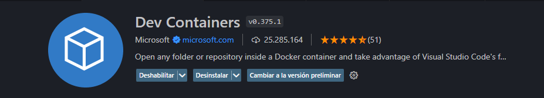

# ProjectZombIoT
Project ZombIoT es un simulador en el que tienes que administrar un edificio infestado con zombies.

# ¿Cómo instalar?
## DevContainer
Dev Containers es una tecnología basada en contenedores que permite útilizar imágenes de docker directamente conectadas a VSCode, de esta manera todas las dependencias de desarrollo quedan encapsuladas en el contenedor -incluso las extensiones útilizadas- y no se carga contenido "basura" dentro de la máquina Host. Para utilizar devcontainer basta con instalar la extensión "Dev Containers" en VSCode y tener Docker instalado.

Una vez instalado, basta con ejectuar `uv run main.py` o `python main.py`

## Instalación directa
Para utilizar la aplicación de manera directa es necesario tener instalado Python 3 y ejecutar `python main.py`

# Acerca del proyecto
El proyecto esta creado usando una arquitectura por capas (Modelos - Simulación - CLI), utilizando en fuerte enfoque orietado a objetos por sobre funcional.
Dada la necesidad de composición del concepto de "Edificio", este sistema usa el patrón Composite para la construcción y administración de este mismo.

## Clases:
- Building: Administra el edificio.
- Floor: Administra cada piso del edificio.
- Room: Administra cada habitación de cada piso.
- Sensor: Administra el sensor.
- Simulation: Clase enfocada en la realización de la simulación
- ZombieCrisisUI: Interfaz CLI.

## Dependecias:
Este proyecto utiliza `uv` para la generación del proyecto, pero no es necesario usarlo en la ejecución del proyecto.
